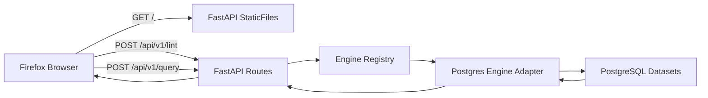

# SQL Practice Lab: Deep Walkthrough

This document explains the full system design, what each file does, how commands work, why certain technology choices were made, and how to maintain and evolve the project without AI.

## 1) System Goals

The project is intentionally optimized for:

- Real SQL semantics and realistic query performance metrics
- Local-first self-hosting with no paid infrastructure
- Minimal frontend stack (plain HTML/CSS/JS)
- Extensible backend architecture for future multi-engine support
- Fast iteration on a laptop (M-series Mac included)

## 2) High-Level Architecture



Execution path in plain terms:

1. Browser loads static files (`index.html`, `styles.css`, `app.js`) from FastAPI.
2. JS sends API calls (`/engines`, `/datasets`, `/lint`, `/query`).
3. FastAPI routes validate payloads with Pydantic models.
4. Engine registry selects the configured backend engine (`postgres`).
5. Postgres adapter lint-checks SQL and executes SQL through psycopg.
6. API returns JSON result payload with diagnostics + metrics.
7. JS renders results table, editor squiggles, timing tiles, and history.

## 3) Infrastructure and Runtime: What Runs Where

## 3.1 Docker's role

Docker runs PostgreSQL in an isolated Linux container so you do not need a manual local Postgres installation.

Container responsibilities:

- Runs the `postgres:17` server process
- Persists database files using named volume `postgres_data`
- Exposes Postgres on local port `5432`
- Reports health via `pg_isready`

This keeps database setup reproducible and disposable:

- If data gets messy, reset/reseed without touching your host OS install.
- Team members can run the same version and avoid "works on my machine" drift.

## 3.2 Python backend's role

The FastAPI app acts as:

- Static file host for the frontend
- API layer for lint/query operations
- Engine abstraction point for future Oracle/T-SQL adapters
- Place where execution metrics and error handling are standardized

## 3.3 Browser frontend's role

The frontend handles:

- Editor UX (Monaco)
- Rendering diagnostics and query outputs
- Session query history (`sessionStorage`)
- Calling backend APIs and managing UI state

## 4) Setup Commands Explained (How and Why)

From repo root:

```bash
make db-up
make setup
cp .env.example .env
make db-seed
make run
```

What each command does:

### `make db-up`

Expands to:

```bash
docker compose up -d postgres
```

Why it exists:

- Starts Postgres container in detached mode
- Creates `postgres_data` volume if missing
- Brings up a known DB runtime baseline for everyone

### `make setup`

Expands to:

```bash
python3 -m venv .venv
.venv/bin/pip install --upgrade pip
.venv/bin/pip install -r requirements.txt
```

Why it exists:

- Isolates dependencies per-project
- Pins backend dependencies to known versions
- Avoids polluting global Python packages

### `cp .env.example .env`

Why it exists:

- Separates local runtime config from committed defaults
- Allows host/port/password changes without code edits
- Keeps secrets out of git (`.env` is gitignored)

### `make db-seed`

Expands to:

```bash
.venv/bin/python scripts/init_practice_datasets.py
```

Why it exists:

- Creates all practice databases if missing
- Resets schema in each database
- Seeds shared baseline + domain-specific datasets
- Runs `ANALYZE` so query planner stats are populated

### `make run`

Expands to:

```bash
.venv/bin/uvicorn app.main:app --reload --host 127.0.0.1 --port 8000
```

Why it exists:

- Runs local backend + static host
- `--reload` auto-restarts when files change
- Gives one local URL for both UI and API

## 5) Why It Feels "Seamless"

The setup feels smooth because the project is designed to reduce hidden state:

1. Single command per stage (`db-up`, `setup`, `db-seed`, `run`)
2. Dockerized DB version pinning (`postgres:17`)
3. Idempotent seed script behavior (create if missing + reset schema)
4. Backend defaults in config with env override support
5. Frontend is static files, so no Node build chain required

## 6) File-by-File Code Tour

## 6.1 Root and project config files

| File | What it does | Why it exists |
|---|---|---|
| `.env.example` | Template of runtime env vars | Documents expected config and defaults |
| `.gitignore` | Excludes `.env`, `.venv`, caches | Prevents leaking local/secrets/noise |
| `Makefile` | Defines `setup`, `db-up`, `db-seed`, `run` targets | Fast onboarding and consistent commands |
| `requirements.txt` | Pinned Python dependencies | Reproducible backend installs |
| `docker-compose.yml` | Defines local Postgres service and volume | Reproducible DB infrastructure |
| `README.md` | Quick start and high-level overview | Entry point for new contributors |

## 6.2 Backend application files

| File | What it does | Why it exists |
|---|---|---|
| `app/main.py` | Creates FastAPI app, mounts API router and static files | Single backend entrypoint for Uvicorn |
| `app/api/routes.py` | Defines API endpoints (`health`, `engines`, `datasets`, `lint`, `query`) | Main HTTP contract for frontend |
| `app/core/config.py` | Loads environment config with Pydantic settings | Centralized config and DSN generation |
| `app/core/models.py` | Request/response/diagnostic models | Type-safe API payload definitions |
| `app/core/diagnostics.py` | SQL parse diagnostics + warning rules (`SELECT *`, unsafe `DELETE/UPDATE`) | Editor squiggles and pre-execution validation |
| `app/engines/base.py` | Abstract engine interface and execution result dataclass | Adapter contract for future engines |
| `app/engines/postgres.py` | Postgres implementation: lint, execute, explain, pooling | Current real execution backend |
| `app/engines/registry.py` | Registers available engines and resolves by name | Keeps engine selection decoupled from routes |
| `app/__init__.py` | Package marker | Enables import resolution |
| `app/api/__init__.py` | Package marker | Enables subpackage imports |
| `app/core/__init__.py` | Package marker | Enables subpackage imports |
| `app/engines/__init__.py` | Package marker | Enables subpackage imports |

## 6.3 Frontend files

| File | What it does | Why it exists |
|---|---|---|
| `app/static/index.html` | Defines SSMS-style layout shell and panel structure | Static UI skeleton |
| `app/static/styles.css` | Defines visual theme/layout/typography/responsive behavior | Clean performance-first styling without frameworks |
| `app/static/app.js` | UI state, API calls, Monaco setup, marker rendering, result/history rendering | Entire frontend behavior in plain JS |

## 6.4 Data and seeding files

| File | What it does | Why it exists |
|---|---|---|
| `scripts/init_practice_datasets.py` | Creates DBs, loads schema and seed SQL, runs `ANALYZE` | Automated reproducible dataset initialization |
| `sql/schema.sql` | Drops/recreates all tables and indexes | Shared relational model across datasets |
| `sql/seeds/common.sql` | Inserts shared departments/employees/customers/suppliers/products | Baseline entities used by all domains |
| `sql/seeds/sales_lab.sql` | Seeds orders and order items with realistic cardinality | Sales-focused query practice |
| `sql/seeds/hr_lab.sql` | Seeds reviews and attendance | HR analytics practice |
| `sql/seeds/finance_lab.sql` | Seeds accounts and transactions | Financial reporting/query practice |
| `sql/seeds/healthcare_lab.sql` | Seeds patients and visits | Healthcare domain practice |
| `sql/seeds/logistics_lab.sql` | Seeds warehouses and shipments | Operational/logistics query practice |
| `sql/seeds/social_lab.sql` | Seeds users, posts, comments | High-volume social data practice |
| `docs/architecture.md` | Concise architecture summary | Quick reference for engine extension approach |
| `docs/walkthrough.md` | This deep dive | Full operational and implementation guide |

## 7) Cross-Language Interactions (How Different Files "Talk")

There are three languages in play: HTML/CSS/JS, Python, and SQL.

## 7.1 JavaScript to Python (HTTP JSON boundary)

- JS calls backend routes using `fetch`.
- Payloads are JSON (`sql`, `engine`, `dataset`, options).
- FastAPI validates these using Pydantic models.
- Python returns JSON data for diagnostics, rows, and metrics.
- JS maps JSON into DOM updates and Monaco markers.

Contract examples:

- `POST /api/v1/lint` with `LintRequest` -> `LintResponse`
- `POST /api/v1/query` with `QueryRequest` -> `QueryResponse`

## 7.2 Python to SQL (DB driver boundary)

- Python adapter opens pooled psycopg connection to selected database.
- Executes SQL exactly against PostgreSQL engine semantics.
- Pulls rows/columns/status and wraps into API response.
- Optional explain path executes `EXPLAIN (ANALYZE, BUFFERS, FORMAT JSON)`.

## 7.3 SQL to JavaScript feedback loop

- Query results and planner info come back as JSON.
- Frontend renders table + performance tiles.
- Parse/lint errors become Monaco inline markers (underlines/squiggles).

## 8) Is Using a Python API "Cheating"?

Short answer: no. It is the standard architecture for this type of local web tool.

What the Python layer adds:

- Security boundary: browser never gets direct DB credentials
- Validation layer: request shapes and engine selection are controlled
- Abstraction layer: makes future Oracle/T-SQL adapters practical
- Consistent error and metrics formatting for the UI

What you give up vs direct browser->DB:

- A small amount of backend complexity
- One extra network hop (localhost, minimal overhead)

Direct browser->DB is generally not viable/safe for this use case due to credentials, CORS, and poor control over execution policies.

## 9) Technology Tradeoffs and Alternative Designs

## 9.1 Why PostgreSQL first

Pros:

- Real semantics and planner behavior
- Strong local tooling and free licensing
- Ideal stepping stone toward future Oracle/Postgres career path

Cons:

- Slightly heavier than SQLite setup
- Requires container/runtime management

## 9.2 Why not SQLite as primary engine

SQLite is great for lightweight exercises but weaker for your stated goal:

- Different SQL dialect and planner behavior
- Less realistic performance characteristics for enterprise workloads
- Missing engine features important for Oracle/Postgres parity

## 9.3 Why FastAPI over Node/Go here

FastAPI benefits for this project:

- Minimal code for typed APIs
- Strong ecosystem for DB + config + validation
- Fast enough for this workload

Node/TS alternative:

- Could reduce language count if you prefer JS-only stack
- You would likely use Express/Fastify + `pg` + schema validation libs
- Similar outcome, different tooling ergonomics

Go alternative:

- Excellent performance and static binary distribution
- More boilerplate for comparable iteration speed
- Good fit if operational simplicity/deployment scale becomes primary

## 10) How to Modify This Repo Without AI

## 10.1 Day-to-day developer loop

1. Create feature branch
2. Make changes
3. Run local checks
4. Run app and manually test
5. Commit and push
6. Open PR and review

Suggested commands:

```bash
git checkout -b codex/your-feature
PYTHONPYCACHEPREFIX=/tmp/pycache python3 -m compileall app scripts
make run
```

## 10.2 Safe areas to edit first

- UI structure: `app/static/index.html`
- UI behavior: `app/static/app.js`
- API behavior: `app/api/routes.py`
- SQL lint/warnings: `app/core/diagnostics.py`
- Dataset volume/domain: `sql/seeds/*.sql`

## 10.3 Common upgrade paths

1. Add authentication for multi-user mode
2. Add test suite (`pytest` + API tests)
3. Add migrations (Alembic) instead of raw schema reset
4. Add downloadable local Monaco assets for offline use
5. Add new engine adapters (Oracle/Postgres/T-SQL split)
6. Add query tabs, saved snippets, and result export (CSV)

## 10.4 If you later add Oracle/T-SQL

Implementation shape:

1. Add new adapter class in `app/engines/`
2. Implement `list_datasets`, `lint`, `execute`
3. Register in `EngineRegistry`
4. Add engine-specific env config
5. Expand seed/deployment strategy per engine

The frontend should require little to no change because it already consumes engine-agnostic endpoints.

## 11) Known Constraints and Risks

- Monaco is currently loaded from CDN, so internet is required for editor assets.
- There is no automated test suite yet.
- Seeding is intentionally large and can take noticeable time.
- `EXPLAIN ANALYZE` executes queries again; it measures real runtime but adds execution overhead.

## 12) Suggested Next Steps

1. Add a lightweight `pytest` suite for `/lint` and `/query` happy/failure paths.
2. Add seed-size presets (`small`, `medium`, `large`) for faster local resets.
3. Add one more metrics panel for network + JSON serialization timings.
4. Add an optional "safe mode" that blocks non-SELECT statements.

